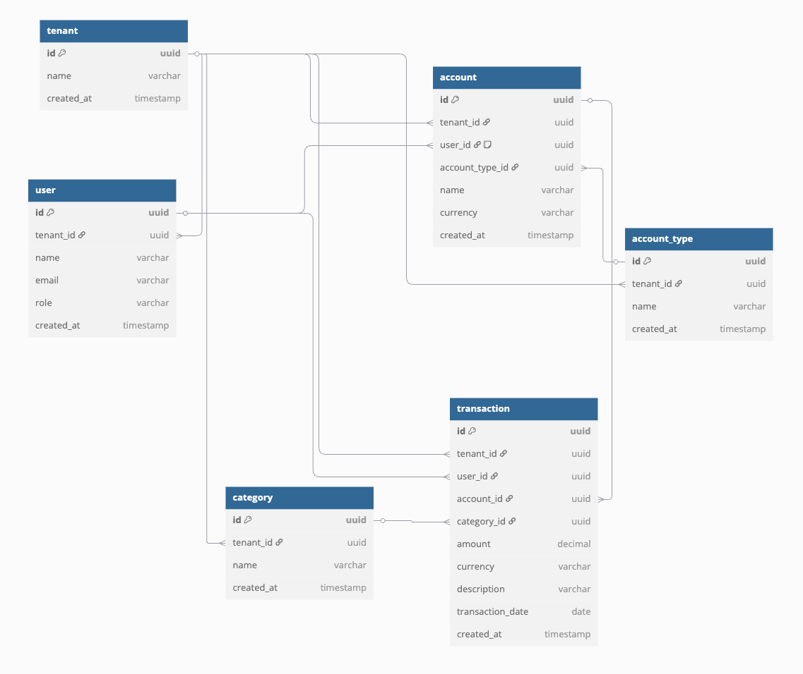

  

[circleci-image]: https://img.shields.io/circleci/build/github/nestjs/nest/master?token=abc123def456

[circleci-url]: https://circleci.com/gh/nestjs/nest

# 📒 Family Budget — Database Structure

## 📚 Entities

### User

- Creates **transactions**.
- May have personal **accounts** (optional).

### Account

- Belongs to an **AccountType**.
- Optionally assigned to a **User** (personal account).
- Stores **currency** (e.g., 'USD', 'PLN').

### Category

- Shared across all **Users**

### Transaction

- Linked to an **Account** and a **Category**.
- Created by a **User**.

---

## 🔗 Relationships Diagram

---

## 🛠 Key Points

- **Account types** (like `cash`, `bank account`, `credit card`) are defined per family.
- **Accounts** belong to a type and can be either common or personal.
- **Transactions** store amounts in the currency of the related **Account**.
- Every **Transaction** records **who** created it.

## License

Nest is [MIT licensed](LICENSE).
